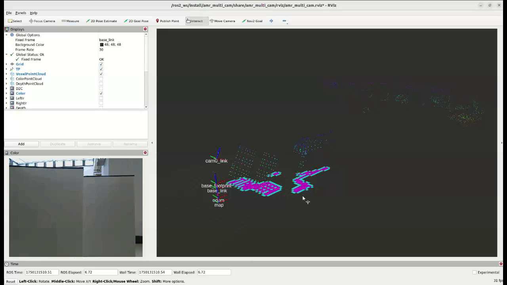
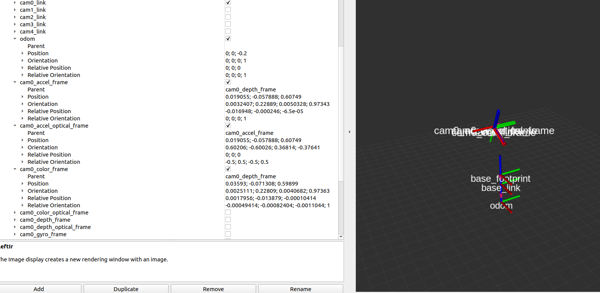

# **Orbbec ROS 2 Demonstration Container**

> A prebuilt Docker container based on Ubuntu 22.04, providing an all-in-one ROS 2 environment for Orbbec depth camera demonstration.

## Suggested Container Name on Container Catalog

`orbbec/orbbec-ros2-3dcamera:v1.0.0-dev`  
(Recommended format: `vendor/image_name:tag`)

## Container Functional Overview

This container provides a complete demonstration environment for Orbbec depth cameras using ROS 2. It includes:

- Orbbec camera drivers

- Functional sample packages

- Pre-configured RViz2 visualization

- Udev rules and system setup scripts for camera detection

Designed for quick testing, development, and evaluation of Orbbec cameras on any Linux host with Docker installed.

## Container Key Features

- Pre-installed ROS 2 (Humble)

- Built-in OrbbecSDK ROS 2 wrapper

- Supports RViz2 visualization

- Includes RGB/Depth/IR/D2C/PointCloud demos

- Launch-ready functional AMR-style example

- Works out of the box with supported USB-connected Orbbec devices

## Supported Host Device List

| Platform | Compatibility |
| -------- | ------------- |
| x86_64   | Tested        |

## Prerequisite Software Libraries on Host OS

Before running the container, make sure your host has:

- **Docker Engine**  
  Version 20.10 or newer is recommended for best compatibility.  
  Installation guide: https://docs.docker.com/engine/install/

- **Docker Compose**  
  For managing multi-container setups.

## Software Components Inside the Container Image

- **Base Image**: `ubuntu:22.04`

- **ROS 2**: Humble Hawksbill (also supports Foxy/Jazzy if rebuilt)

- **OrbbecSDK_ROS2**: ROS 2 wrapper for Orbbec camera SDK

- **amr_multi_cam**: Sample functional package for multi-camera use case

- **RViz2**: Pre-installed for visualization

- **colcon**, **argcomplete**, **image_transport_plugins**, and others

## Quick Start Guide

1. Clone the repository to your local machine

```shell
mkdir ~/orbbec_ros2_ws/
git clone https://github.com/Advantech-EdgeSync-Containers/Orbbec-Gemini-3DCamera.git
```

1. Run the build script

```shell
cd ~/orbbec_ros2_ws/Orbbec-Gemini-3DCamera/orbbec-camera-demo
chmod +x build.sh
./build.sh
```

3. Build the ROS 2 workspace 

```shell
colcon build #default compiled
```

4. Launch the camera node

```shell
source ./install/setup.bash
ros2 launch amr_multi_cam single_camera_bringup.launch.py
```

You should see **RViz2** launch automatically. In addition, you should see the published **image streams**, **point clouds**, and **TF data**.

> **Note:**  
> By default, the launch file is configured for the **Gemini 330** series.  
> If you are using a different Orbbec camera model (e.g., Femto, etc.), please **modify the launch file accordingly** to match your device's configuration.

**RGB**, **Depth**, **Stereo IR**, and **Depth to Color Align** Image Display


**Point Cloud Voxelization**

Voxel filtering reduces point cloud density, improving processing speed and system performance.


**DepthPointCloud**

Converts depth information into 3D point cloud data.


**Colored Point Cloud**

Generates colored point clouds by aligning RGB images with depth maps.


**Local Costmap**

The local costmap reflects real-time perception of the robot's immediate surroundings.



**Camera Intrinsics Acquisition**

The `camera_info` topic outputs intrinsic and extrinsic parameters for each sensor.


**Camera Extrinsics Acquisition**

Camera extrinsic parameters are published on the `tf/tf_static` topics, which can be viewed using TF tools or visualized in RViz2.


